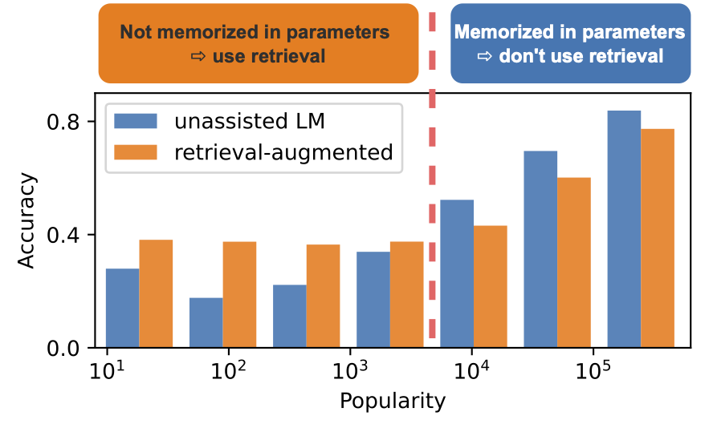

# Adaptive Retrieval: Popularity-based LM Augmentation 

This is the official repository for our preprint: Alex Mallen, Akari Asai, Victor Zhong, Rajarshi Das, Hannaneh Hajishirzi, and Daniel Khashabi. [When Not to Trust Language Models: Investigating Effectiveness and Limitations of Parametric and Non-Parametric Memories](https://arxiv.org/abs/2212.10511). 2022. 

In this work, we conduct a large-scale knowledge probing of 10 language models (GPT-Neo series, OPT series and GPT-3 series) and 4 retrieval-augmentation approaches (BM25, Contriever, GenRead and vanilla), using our new open-domain QA dataset, **PopQA**. 

<p align="center">
  
</p>

We further introduce a simple-yet-effective method, **Adaptive Retrieval**, which adaptively retrieves and incorporates non-parametric memories when necessary. Our experimental results show that Adaptive Retrieval is not only more competitive but also more efficient in terms of inference-time latency as well as the GPT-3 API cost.

### Contact and Citations 
For any questions about the paper or the code, please contact the first authors or leave issues.
If you find our code or paper useful, please cite the paper:
```
@article{ mallen2023llm_memorization ,
  title={When Not to Trust Language Models: Investigating Effectiveness and Limitations of Parametric and Non-Parametric Memories },
  author={ Mallen, Alex and Asai,Akari and  Zhong, Victor and Das, Rajarshi and Hajishirzi, Hannaneh and Khashabi, Daniel},
  journal={ arXiv preprint },
  year={ 2022 }
}
```
## Content

1. [Installation](#installation)
2. [PopQA](#popqa)
3. [Baselines](#baselines)
    - [LMs](#lms)
    - [Retrieval-augmented LMs ](#retrieval-augmented-lms)
    - [Adaptive Retrieval](#adaptive-retrieval)

## Installation 
```
pip install -r requirements.txt
```

## PopQA
We construct an entity-centric open-domain QA dataset, consisting of 14k QA pairs with fine-grained Wikidata entity ID, Wikipedia page views, and relationship type information. 

```
{'id': 4222362, 'subj': 'George Rankin', 'prop': 'occupation', 'obj': 'politician', 'subj_id': 1850297, 'prop_id': 22, 'obj_id': 2834605, 's_aliases': '["George James Rankin"]', 'o_aliases': '["political leader","political figure","polit.","pol"]', 's_uri': 'http://www.wikidata.org/entity/Q5543720', 'o_uri': 'http://www.wikidata.org/entity/Q82955', 's_wiki_title': 'George Rankin', 'o_wiki_title': 'Politician', 's_pop': 142, 'o_pop': 25692, 'question': "What is George Rankin's occupation?", 'possible_answers': '["politician", "political leader", "political figure", "polit.", "pol"]'}
```

The data is available at [data](data/popQA.tsv). 

PopQA is also available available at huggingface datasets: [akariasai/PopQA](https://huggingface.co/datasets/akariasai/PopQA)
```python
import datasets
popqa = datasets.load_dataset("akariasai/PopQA")["test"]
```
## Baselines

### LMs
You can reproduce our zero-shot prompting experiments by running the command below: 
```bash
python run_model.py \
    --model_name MODEL_NAME \
    --input_file data/popQA.tsv \
    --eval_method vanilla
```
We use the [int8bit](https://arxiv.org/abs/2208.07339) quantization to run GPT-Neox-20B and OPT-13B in our environment (a single V100 Volta 32 GB GRAM). 

```sh
python run_model.py \
    --model_name EleutherAI/gpt-neox-20b \
    --input_file data/popQA.tsv \
    --eval_method vanilla \
    --int8bit
```

### Retrieval-augmented LMs
To run retrieval-augmented LMs using BM25 or [Contriever](https://github.com/facebookresearch/contriever), please download the retrieval results [here](https://drive.google.com/drive/folders/1ggeoHbSPobbGOljOlwl_d16yssSygYqy?usp=sharing). 

Then, you can run the retrieval-augmented baselines as follows:
```sh
python run_model.py \
    --model_name MODEL_NAME \
    --input_file data/popQA.tsv \
    --eval_method contriever \
    --ret_file PATH_TO_RETRIEVED_DOCUMENTS.jsonl
```
To run GenRead, you don't need to specify the retrieval file path.
```sh
python run_model.py \
    --model_name MODEL_NAME \
    --input_file data/popQA.tsv \
    --eval_method genread 
```

### Adaptive Retrieval
See the `adaptive-retrieval.ipynb` notebook, where you can point to the results files (obtained from `run_model.py`) for a parametric (vanilla, GenRead) and non-parametric (BM25, Contriever) evaluation, which will be used to compute adaptive results.
